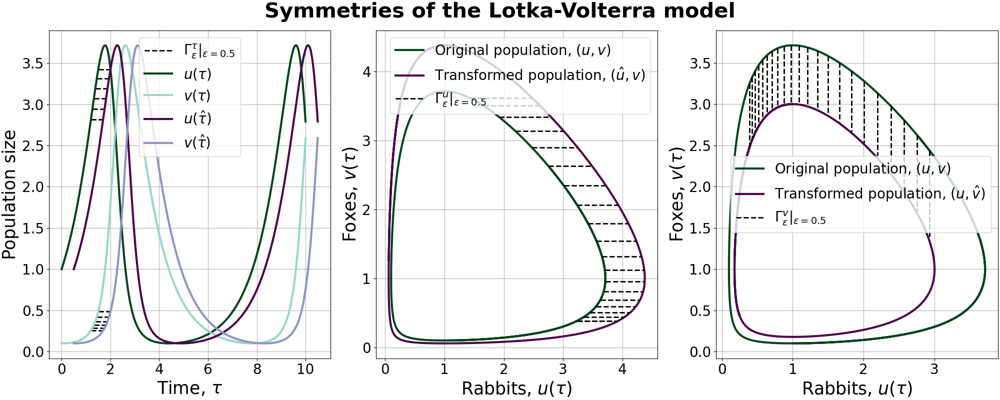
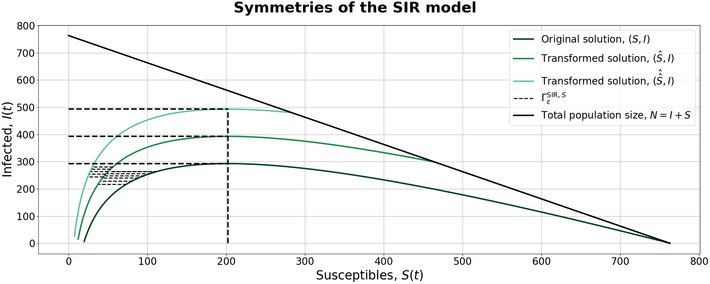
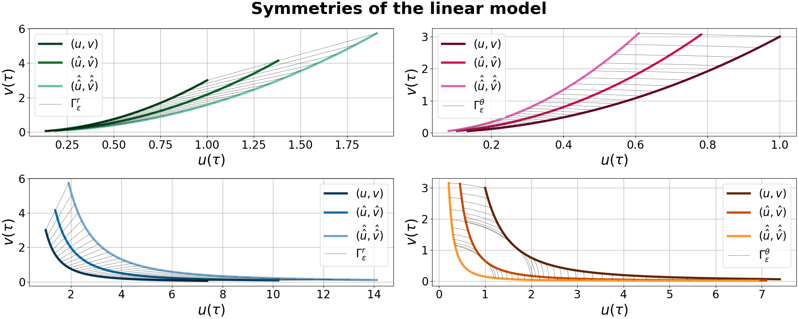
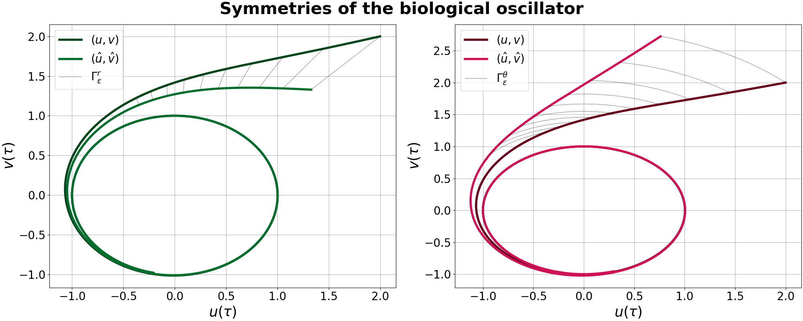

# Visualising the phase-plane symmetries of separable models
*Written by:* Johannes Borgqvist 
*Date:* 2022-07-12 
Welcome to the github-repositry *separable\_phase\_plane\_symmetries*! This project is entirely written in Python meaning that it is open-source, and our aim is that the results in the article entitled ``*Phase-plane symmetries of separable models in biology*'' (**Reference to future article**) should be reproducable. Let's describe the project and all the relevant packages!

## Description of the project
This project concerns the symmetries of phase plane models that are commonly occuring in biology. Specifically, we consider the (u,v)-phase plane ODE for separable models. In particular we consider four different models, namely the *Lotka-Volterra model*, the *SIR model*, the *linear model* and the *biological oscillator* whose symmetries are illustrated below. 

