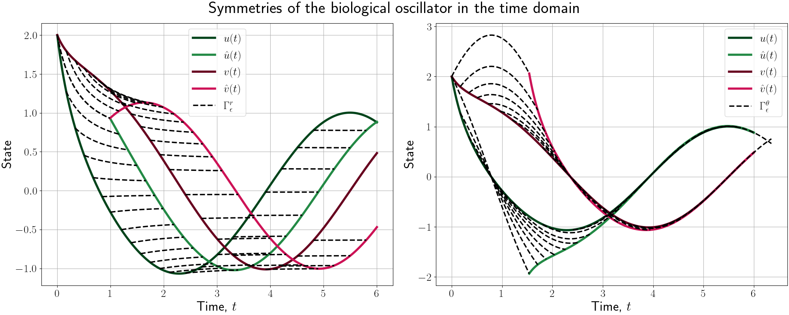
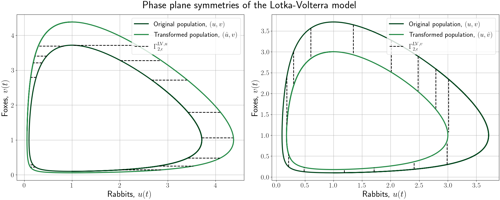
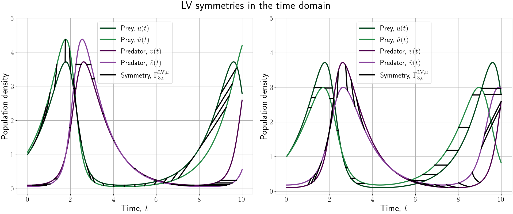
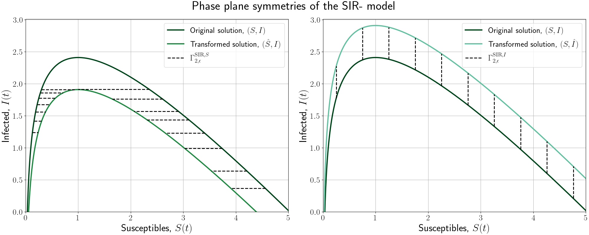
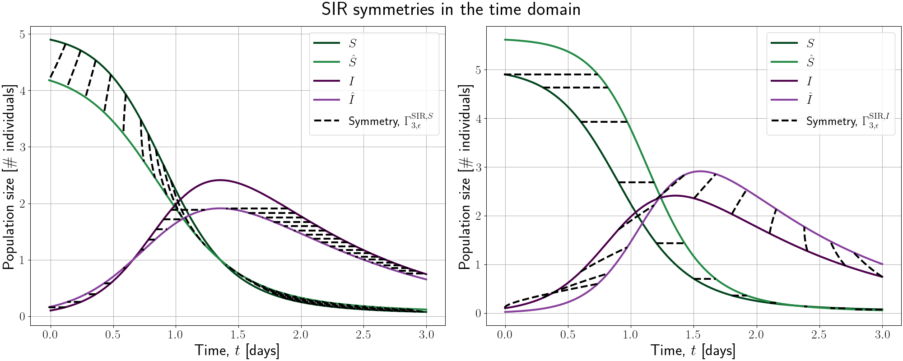

# Visualising the phase-plane symmetries of separable models
*Written by:* Johannes Borgqvist 
*Date:* 2022-07-12 
Welcome to the github-repositry *separable\_phase\_plane\_symmetries*! This project is entirely written in Python meaning that it is open-source, and our aim is that the results in the article entitled ``*Phase-plane symmetries of separable models in biology*'' (**Reference to future article**) should be reproducable. Let's describe the project and all the relevant packages!

## Description of the project
This project concerns the symmetries of phase plane models that are commonly occuring in biology. Specifically, we consider the symmetries of the (u,v)-phase plane ODE of separable models. In particular we consider four different models, namely the *Lotka-Volterra model*, the *SIR model*, the *linear model* and the *biological oscillator* whose symmetries are illustrated below. 

This repositry contains the python-scripts necessary for generating the above figure, and in particular these figures are generated by running the script "*plot\_phase\_plane\_symmetries.py*" in the Code subfolder. 

## The required Python packages
The main Python packages are the following:

1. *scipy* version:1.6.2,
2. *numpy* version: 1.20.1,
3. *matplotlib* version: 3.3.4. 

These scripts have been developed on a computer with the OS Ubuntu 20.04. The version of Python that has been used is 3.8.8. 
